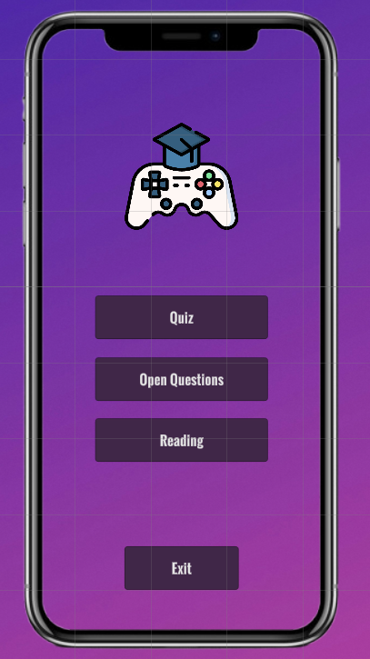
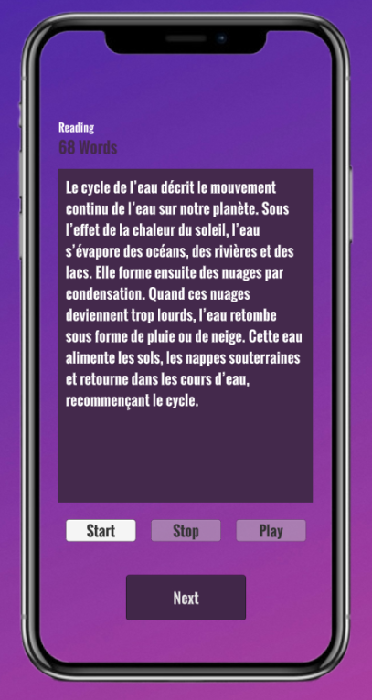
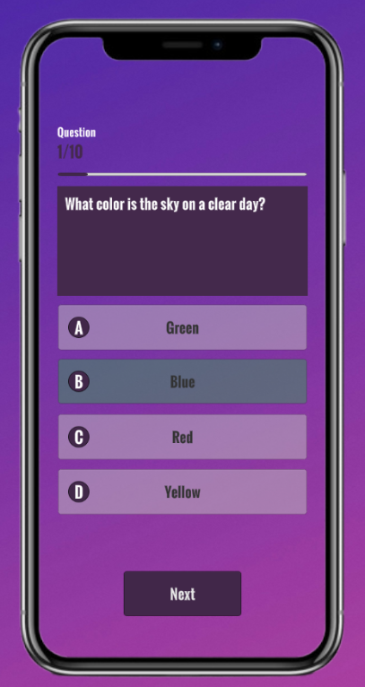
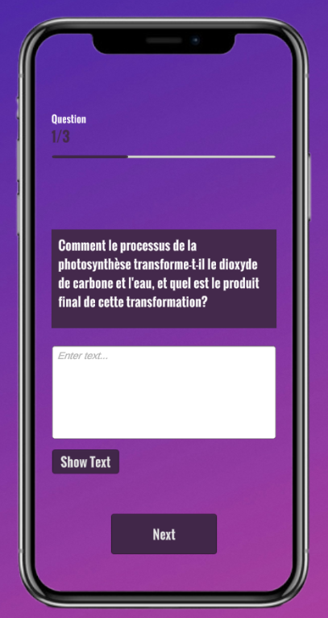

# Unity Educational Quiz Game

An educational mobile game built in Unity, designed to teach and test learners through an engaging and interactive quiz experience. The game incorporates multiple animations, feedback mechanisms, and supports both multiple-choice and open-ended questions.

## Features

### 1. **Quiz System**
- Multiple-choice questions with 4 selectable answers.
- Open-ended question support (generated via Flask backend with Gemini LLM).
- JSON-based question loading system for flexibility and easy updates.
- Scrollable text panels for longer question passages or explanations.
- Real-time feedback (correct/incorrect answer highlighting).
- Score tracking and final score display at the end of the quiz.

### 2. **Open Questions**
- Open questions are generated using a Python Flask backend connected to Gemini LLM.
- Questions are saved in a MongoDB collection for persistence.
- Unity retrieves and displays these open questions for users to answer verbally or via text.
- Includes audio recording of spoken answers.
- Saved answers include both the question and the recorded audio in base64 format.
- Integrated view to switch between the question and the scrollable explanation text.
- Ensures seamless navigation between open questions and the rest of the quiz.

### 3. **User Interface Enhancements**
- Smooth transitions between questions using fade-in animations.
- Button bounce effects when selected.
- Shake animation for incorrect answers to reinforce feedback.
- Dedicated scroll view for text content with "Show Explanation" buttons per question.
- UI panel toggling to switch between question view and explanation text seamlessly.

### 4. **Audio Recording Integration**
- Users can record their answers to open questions.
- Audio saved in `.json` with base64 WAV data.
- Recording system handles multiple entries, appending to a structured list.
- File management: recordings stored in `Assets/ReadingAnswers/`.

### 5. **Backend Integration**
- Flask server integrated with Gemini AI API to:
  - Generate quizzes from input text.
  - Generate both open-ended and yes/no questions.
  - Store generated questions in MongoDB for persistence.

### 6. **Data and File Management**
- Recorded audio and associated text are saved locally as JSON.
- Unity’s `JsonUtility` used for serialization.
- Graceful handling of existing files: data is read, extended, and rewritten cleanly.

### 7. **Design and Architecture**
- Modular quiz manager logic separated from UI code.
- Data classes (`Question`, `Answer`, `RecordingData`, etc.) defined for maintainability.
- Unity's event system used to manage answer selection and transitions.

## Tech Stack

- **Frontend**: Unity (C#)
- **Backend**: Flask (Python), Gemini API, MongoDB
- **Tools**: Unity Animator, UnityEvents, AudioClip, JsonUtility

## Images

Main Menu



Reading Scene



Closed Questions Scene



Open Questions Scene



## Setup Instructions

### Unity Setup
1. Open the project in Unity 2022.3.x or later.
2. Load scenes from `Assets/Scenes/`.
3. Play from the `MainMenu` or `QuizScene`.

### Flask Backend Setup
1. Create and activate a virtual environment.
2. Install dependencies:
   ```bash
   pip install -r requirements.txt
   ```

3. Set your Gemini API key in `.env`:

   ```
   GEMINI_API_KEY=your_api_key_here
   ```
4. Run the Flask app:

   ```bash
   python app.py
   ```

### MongoDB

* Ensure MongoDB is running locally or via cloud.
* Flask backend automatically stores questions into the configured database.

## Future Integrations

* Add user profiles and progress tracking.
* Implement different quiz categories and difficulty levels.
* Add leaderboard and reward system.

## Contributors

* **Samir Taous** – Unity Developer, Backend Integration, UI Designer


---

Let me know if you’d like this exported as a file or published directly into your project’s root.
```

